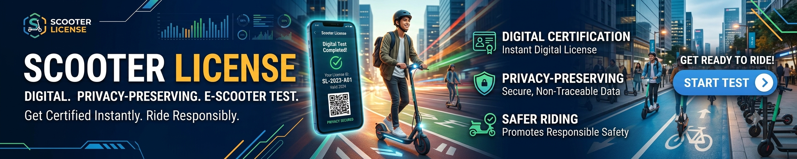
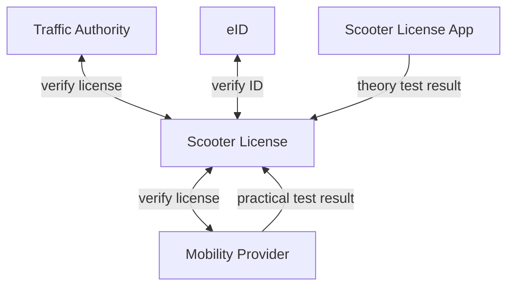

# Scooter License 🛴

Digital, privacy-preserving driving license test for rented stand-up electric scooters (e-scooters).

Why a digital license? Some cities are worried about safety concerns of e-scooters and e-scooter providers want to build trust. A traditional driving license is quite costly and most likely superfluous.

*🚧 Note: Scooter License is a vibe-coded proof-of-concept prototype and provides no real driving license functionality!*



## How it works (concept)

1. Register for the digital e-scooter operator license test with your government-issued ID.
2. Perform a theory test online. You will receive a license ID.
3. Register your license ID with your e-scooter provider. The provider must verify whether the license is valid.
4. Pass a practical test: Your first 120 cumulative minutes of e-scooter rides are analyzed using AI. You must pass all criteria in at least 90 of these 120 minutes.
5. Once you pass both tests, your digital license is activated. Now, you are free to ride.
6. If stopped by authorities, show your provider app's QR code (containing license ID) and your government-issued ID for verification. If your driving style is deemed unsafe by authorities, the license may be revoked or temporarily suspended.

Step 1 and 2 may be performed in the Scooter License web app or the e-scooter mobility provider may integrate it into their app. The license works with any compliant e-scooter sharing service.

To prevent fraud, providers must implement random identity verification at ride start (e.g., selfie scan or eID NFC scan, subject to GDPR compliance).



Alternative: Users with a valid car or motorcycle license are automatically granted an e-scooter operator license, as they have already demonstrated road safety knowledge.

## Who demands the Scooter License?

There are two possible ways the Scooter License may be used:

1. Providers may require it to increase public trust in e-scooters and encourage wider adoption.
2. Cities may enforce it as part of local traffic regulations (e.g., to reduce accidents or sidewalk riding). Demanding a license is better than banning e-scooters completely.

Risk: A mandatory license may reduce e-scooter adoption by making them less attractive to casual users, harming mobility transition.

## Development

The proof of concept is a frontend-only [Next.js](https://nextjs.org) app. It is built as a static export, with no backend.

- `/`: introduction
- `/apply`: wizard with dummy personal details, a simulated eID check and the theory test
- `/license`: digital license card with QR code, plus buttons that simulate rides for the practical test
- `/integration`: plan for how providers, eID and authorities could integrate (not implemented)

All data is dummy data, stored only in the browser's `localStorage`. The app doesn't contact any authority or e-scooter provider.

```bash
npm install
npm run dev     # dev server at http://localhost:3000
npm run build   # static export to ./out
npm run lint
```
